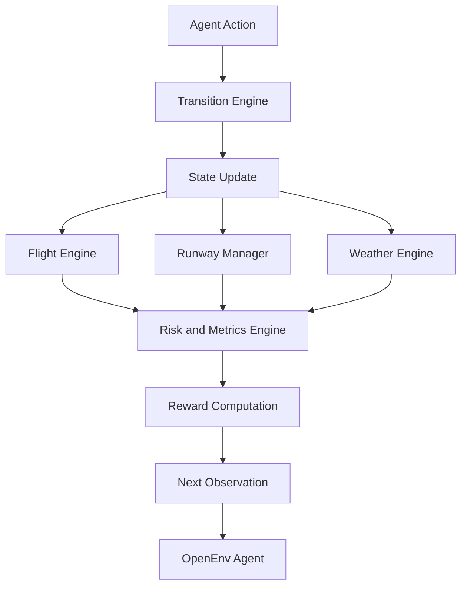

# MACE: Multi-Agent Aviation Control and Oversight Environment

A benchmark-grade OpenEnv environment for evaluating AI agents in aviation operations control.

[](#)
[](#)
[](#)

MACE evaluates AI agents on realistic, safety-critical aviation control tasks through the standard OpenEnv `step()`, `reset()`, and `state()` API.

---

## Table of Contents

- [Overview](#overview)
- [Why MACE Matters](#why-mace-matters)
- [Hackathon Alignment](#hackathon-alignment)
- [System Architecture](#system-architecture)
- [Action Space](#action-space)
- [Observation Space](#observation-space)
- [Task Progression](#task-progression)
- [Reward Design](#reward-design)
- [Quickstart](#quickstart)
- [Docker Deployment](#docker-deployment)
- [Inference and Baseline Evaluation](#inference-and-baseline-evaluation)
- [Baseline Results](#baseline-results)
- [Training, Evaluation, and Demo](#training-evaluation-and-demo)
- [Design Scope](#design-scope)
- [Novelty](#novelty)
- [Project Information](#project-information)

---

## Overview

Modern aviation operations require fast, high-stakes decision-making under strict safety constraints. Controllers must continuously manage runway allocation, arrival sequencing, delay handling, weather-aware operations, fuel-critical prioritization, and emergency coordination.

MACE is an OpenEnv-compatible benchmark environment that simulates aviation operations control at the decision-making level. It is designed to evaluate how well AI agents reason under pressure, respect operational constraints, and optimize competing objectives such as safety, efficiency, throughput, and robustness.

Unlike simple scheduling tasks, MACE introduces aviation-relevant risks. Poor decisions can create conflicts, amplify delays, misuse closed infrastructure, or fail to prioritize fuel-critical and emergency aircraft.

---

## Why MACE Matters

Aviation control is a strong real-world benchmark for AI agents because it combines:

- Safety-critical decision-making
- Multi-agent coordination
- Resource allocation under constraints
- Time-sensitive prioritization
- Dynamic environmental conditions
- Deterministic and reproducible evaluation

MACE provides a structured environment for evaluating AI copilots, sequencing policies, oversight agents, and reinforcement learning systems in a domain where correctness, prioritization, and constraint awareness matter.

---

## Hackathon Alignment

MACE is designed for the OpenEnv Hackathon and satisfies the Round 1 evaluation requirements.

| Criteria | MACE Implementation |
| :--- | :--- |
| Real-world task | Models operational aviation control decisions inspired by real control-room workflows. |
| OpenEnv compliance | Implements typed `Observation`, `Action`, and `Reward` models with `step(action)`, `reset()`, `state()`, and `openenv.yaml` support. |
| Multiple tasks | Includes three deterministic tasks across Easy, Medium, and Hard difficulty levels. |
| Deterministic graders | Each task is graded on a reproducible `[0.0, 1.0]` scale using aviation-relevant criteria. |
| Meaningful rewards | Uses dense reward shaping where safety dominates efficiency and throughput. |
| Baseline inference | Includes root-level `inference.py` with deterministic scripted baseline support and optional LLM-based inference. |
| Deployment ready | Includes Docker support and is ready for Hugging Face Spaces deployment. |

---

## System Architecture

MACE abstracts aviation control at the level of decision logic. It focuses on how an agent reasons about operational constraints, sequencing, prioritization, and safety trade-offs.



---

## Action Space

The action space is built around meaningful aviation control decisions.

| Action | Description |
| :--- | :--- |
| `noop` | Make no operational change. |
| `assign_runway` | Assign a flight to a specific runway. |
| `sequence_landing` | Reorder the approach queue. |
| `hold_pattern` | Keep a flight in a holding pattern. |
| `delay_flight` | Apply a tactical delay. |
| `reroute_flight` | Divert or reroute a flight to an alternate plan. |
| `declare_emergency` | Mark a flight as emergency traffic. |
| `clear_to_land` | Issue landing clearance. |

---

## Observation Space

Each observation provides a structured snapshot of the terminal-control state through `MACEObservation`.

The observation includes:

- Task identity and episode progress
- Flight phase, ETA, fuel level, delay, and emergency status
- Runway occupancy, capacity, and closure status
- Weather visibility and restriction schedules
- Safety metrics, conflict risks, and actionable alerts

---

## Task Progression

MACE includes a deterministic difficulty curve designed to verify basic competence first, then evaluate advanced reasoning under operational stress.

| Task Level | Focus | Scenario | Max Steps | Grader |
| :--- | :--- | :--- | :---: | :--- |
| Easy | Efficient landing scheduling | 3 arrivals, 2 parallel runways, clear weather. | 36 | `grade_easy` |
| Medium | Weather-constrained operations | 4 arrivals with deterministic R2 runway closure windows. | 44 | `grade_medium` |
| Hard | Emergency conflict resolution | 5 arrivals including 1 emergency and 2 fuel-critical flights, with intermittent R1 outages. | 48 | `grade_hard` |

---

## Reward Design

MACE uses dense reward shaping to evaluate both final outcomes and decision quality throughout the episode.

The reward function prioritizes:

1. Safety and conflict avoidance
2. Emergency and fuel-critical handling
3. Valid runway and weather-aware operations
4. Efficient arrival sequencing
5. Delay minimization
6. Throughput and completion quality

Safety violations are penalized more heavily than efficiency mistakes, reflecting the operational priorities of real aviation control systems.

---

## Quickstart

### Local Installation

Requires Python 3.10 or later.

```bash
git clone <repository> mace
cd mace

python -m venv .venv

# Windows
.venv\Scripts\activate

# Linux or macOS
source .venv/bin/activate

pip install -e ".[dev]"
pytest -q
```

### Validate OpenEnv compliance

```bash
openenv validate .
```

---

## Docker Deployment

Build and run the environment locally.

```bash
docker build -t mace-env .
docker run --rm -p 7860:7860 mace-env
```

The server runs on port `7860`.

Validate the running server:

```bash
openenv validate --url http://127.0.0.1:7860
```

---

## Inference and Baseline Evaluation

MACE includes a root-level `inference.py` file for reproducible evaluation.

Run the deterministic scripted baseline.

**Windows (PowerShell):**

```powershell
$env:MACE_INFERENCE_MODE="scripted"
python inference.py
```

**Linux or macOS:**

```bash
MACE_INFERENCE_MODE=scripted python inference.py
```

Optional LLM-driven inference is also supported through the same inference entry point.

---

## Baseline Results

The deterministic scripted baseline produces the following reproducible scores.

| Task | Score | Notes |
| :--- | :---: | :--- |
| Easy | `0.9452` | Total steps: 38 |
| Medium | `0.9649` | Invalid actions: 0 |
| Hard | `0.9327` | Fallbacks: 0 |
| **Mean** | **`0.9476`** | Overall benchmark performance |

---

## Training, Evaluation, and Demo

MACE includes an RL-ready training and evaluation pipeline, along with a judge-facing demo mode.

```bash
python train.py --episodes 50
python eval.py --model latest
python run_demo.py --frame-delay 0.6 --stepwise --orchestrate
```

The demo mode presents a step-by-step operational view with:

- Scenario initialization
- Agent action selection
- Oversight arbitration
- Safety reward updates
- Runway and flight-state transitions
- Final task grading

---

## Design Scope

MACE intentionally focuses on operational decision-making rather than high-fidelity flight physics.

It does not model full aerodynamics or real aircraft control surfaces. Instead, it models the reasoning layer of aviation operations: sequencing, prioritization, runway use, disruption handling, and safety-aware planning.

This makes the environment lightweight, inspectable, deterministic, and suitable for benchmark evaluation.

---

## Novelty

MACE introduces a safety-critical aviation operations domain into the OpenEnv ecosystem.

Its key contributions are:

- A realistic aviation control abstraction
- Multi-agent operational pressure
- Deterministic benchmark tasks
- Dense safety-first reward shaping
- OpenEnv-compatible API design
- Deployment-ready Docker and Hugging Face Spaces support

MACE is designed not only as a hackathon submission, but as a foundation for evaluating AI agents in structured, high-consequence decision environments.

---

## Project Information

| Field | Value |
| :--- | :--- |
| Project | MACE: Multi-Agent Aviation Control and Oversight Environment |
| Version | 1.0 |
| Submission | OpenEnv Hackathon Round 1 |
| Team | Final Commit |
| Members | Ripun Basumatary, Veeshal D. Bodosa, Jeu Machahary |
| Copyright | 2026 Team Final Commit |
